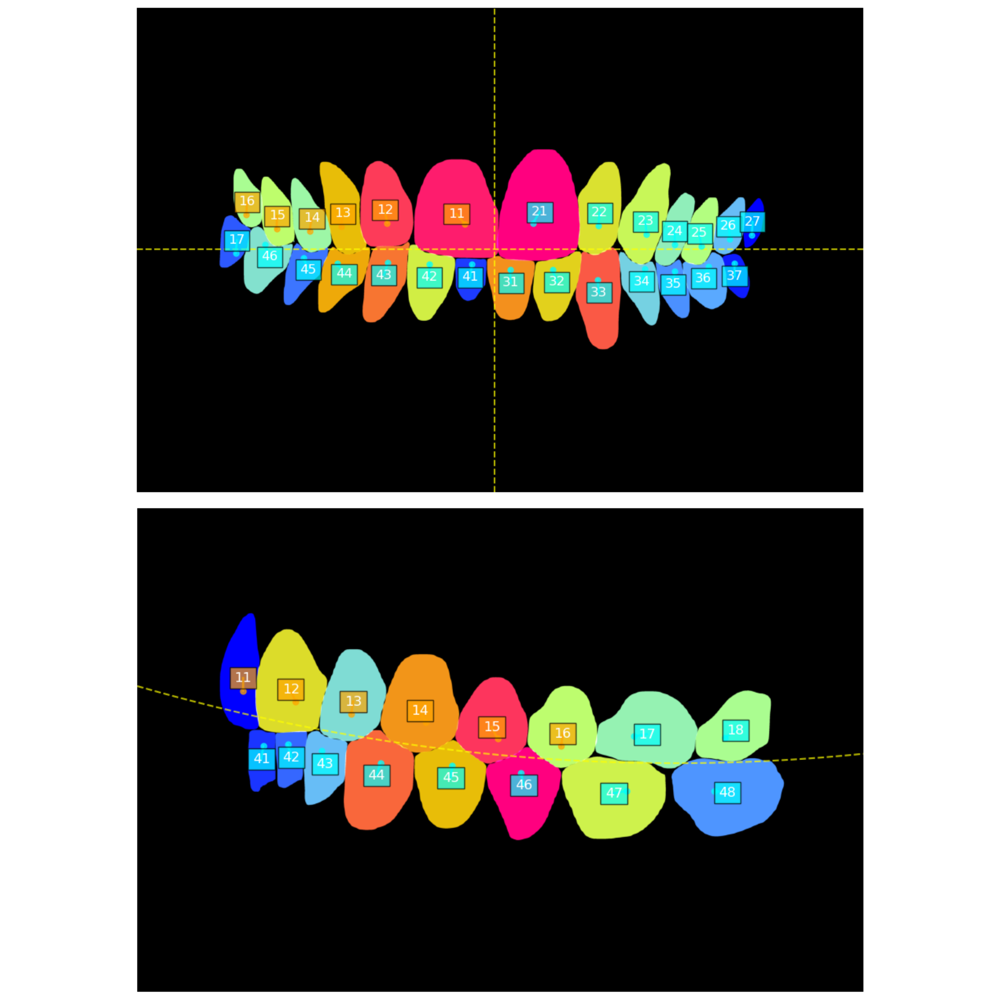
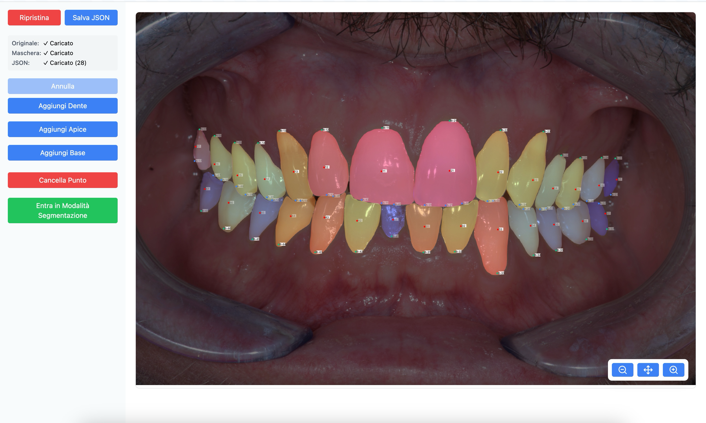

Master’s Degree in Data Science & Scientific Computing

## AI-Driven Dental Model Evolution: Updating 3D Representations Through Sequential 2D Image Analysis

**Candidate:** Agustin Campagnolo  
**Supervisors:** Prof. Fabio Anselmi, Prof. Luca Manzoni

---

# Introduction & Motivation

  

- **Challenge:** Traditional 3D dental imaging (e.g., CBCT, intraoral scanners) is costly, slow, and exposes patients to radiation.
- **Objective:** Reconstruct 3D dental models using just **five standard 2D intraoral images**.
- **Benefits:** Cost-effective, widely accessible, and radiation-free.
- **Clinical Focus:** Enhancing orthodontic monitoring during aligner therapy.
  

  

|  |
| :-------------------------: |
|  Image of intraoral views   |

  

---

# Methodology

  

- **Tooth Segmentation:**
  - **Tool:** Mask R-CNN (ResNet-50 + FPN) detects individual teeth and extracts centroids.
- **Landmark Detection:**
  - **Automated:** Centroids are computed automatically.
  - **Manual:** Apex and base points are annotated due to current detection limits.
- **Tooth Numbering**
  - FDI notation using K-Means clustering and regression.
  

    

|  |
| :--------------------------------: |
|     Image of numbering result      |

  

---

|  |
| :------------------------------: |
|    Image of revision software    |

---

  

- **3D Reconstruction:**
  - **Approach:** Multi-view triangulation with bundle adjustment.
  - **Enhancement:** Incorporates anatomical constraints for realistic tooth alignment.
  

    

  

---

<!-- <video
data-autoplay
src="img/com.mov"> </video> -->

## 

# Key Results

  

- **Accuracy Achieved:**
  - Centroid error: ~6.83 mm (mean across all teeth and all 14 reconstructed patients)
  - Overall landmark error (centroids, apex, base): ~9.07 mm
- **Insight:**
  - Enabling camera translation is critical for accuracy.
    

  

<!-- <video
data-autoplay
src="img/re.mov"> </video> -->

  

---

# Conclusion

- **Current Limitations:**
  - Manual annotation for apex and base is time-consuming.
  - Small, homogeneous dataset (14 patients) limits broader applicability.
- **Future Improvements:**
  - Automate complete landmark detection.
  - Expand the dataset to improve generalizability.
  - Implement more complex anatomical constraints

---

# Thank You
