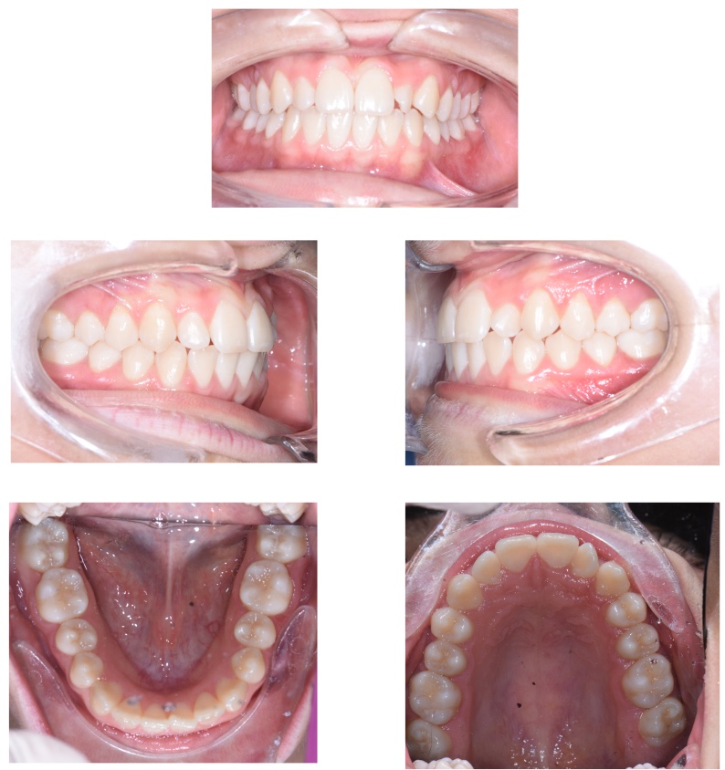
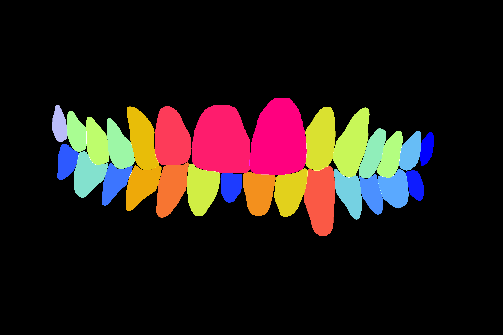
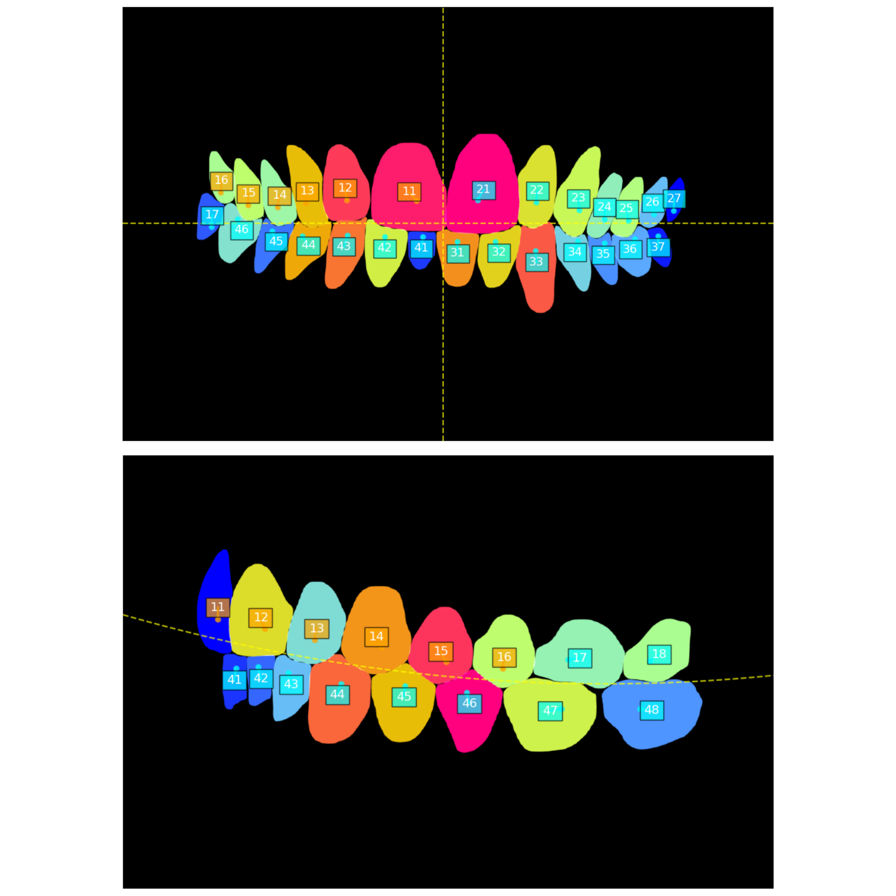
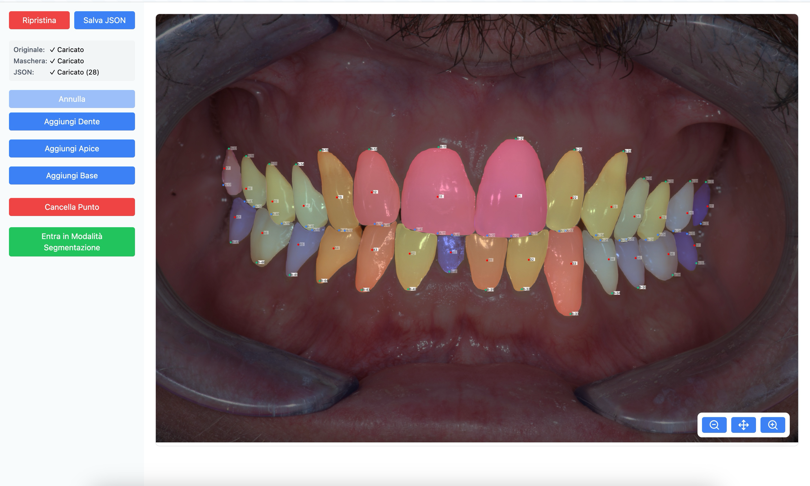
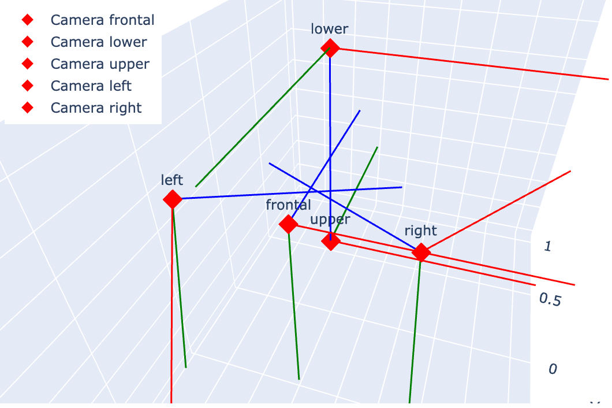
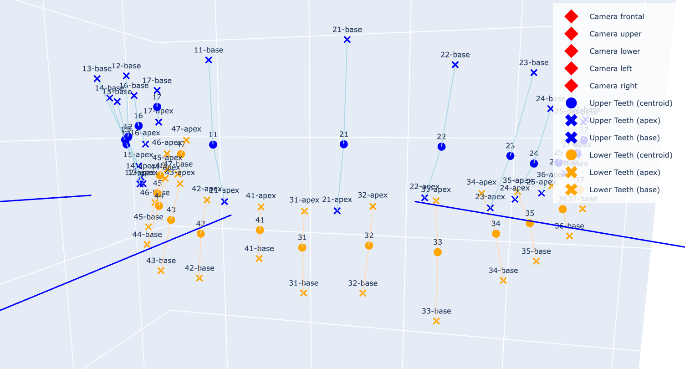
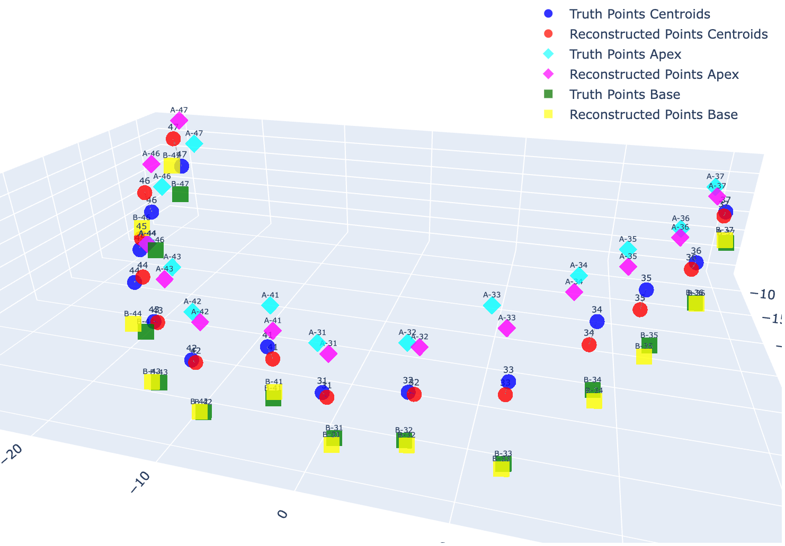
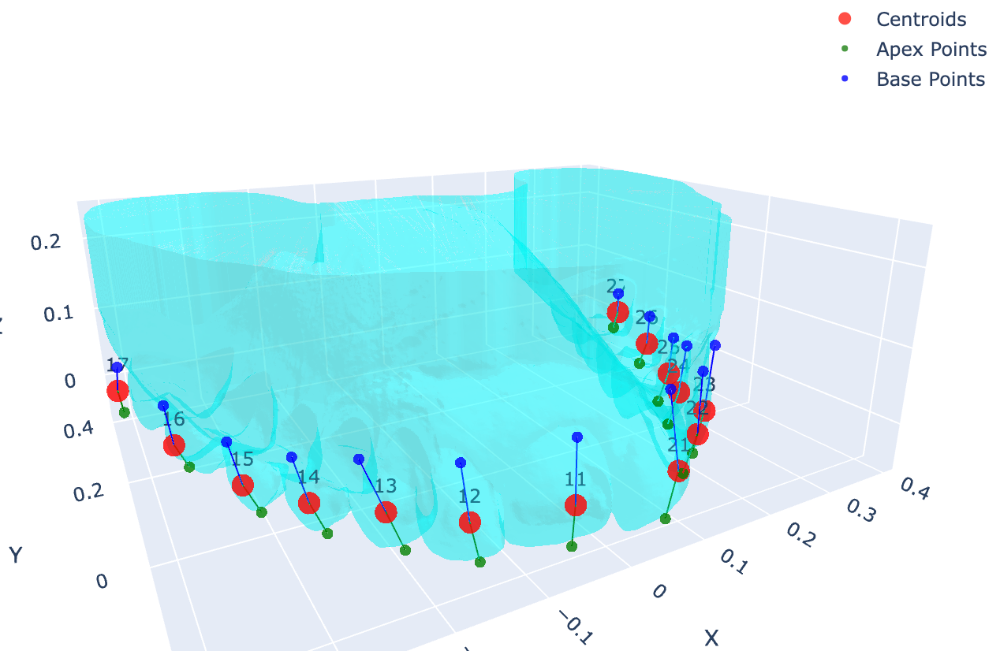

Master’s Degree in Data Science & Scientific Computing

## AI-Driven Dental Model Evolution: Updating 3D Representations Through Sequential 2D Image Analysis

**Candidate:** Agustin Campagnolo

**Supervisors:** Prof. Fabio Anselmi, Prof. Luca Manzoni

---

# Introduction

- **Problem:** Traditional 3D dental imaging (CBCT, intraoral scanners) is expensive, time-consuming, and can involve radiation.
- **Goal:** Reconstruct 3D dental models from only **five standard 2D intraoral images.**
- **Benefits:** Lower cost, greater accessibility, and no radiation exposure.
- **Target:** Orthodontic patients undergoing aligner therapy.
- **Scope:** Proof-of-concept study with 14 patients (two visits each).

---

# Background

### Challenges in 2D-to-3D Dental Reconstruction

- **Occlusion:** Limited visibility of posterior teeth.
- **Perspective Distortion:** Geometric inaccuracies from varying viewpoints.
- **Scale Ambiguity:** Absence of absolute scale information.
- **Anatomical Plausibility:** Maintaining realistic dental morphology.

### Computer Vision

- **Segmentation:** Identify individual teeth (Mask R-CNN).
- **Multi-view Geometry:** Exploit geometric relationships between images.
- **Optimization:** Refine 3D structure (Bundle Adjustment).

---

# Data Description

  

- 14 patients undergoing aligner therapy.
- **Five intraoral views** per patient per visit:
  - Frontal
  - Left lateral
  - Right lateral
  - Upper jaw (occlusal)
  - Lower jaw (occlusal)
- **Two visits**: initial and follow-up.
- Images taken with Nikon D7500 and 105mm lens.

  

  

|  |
| :-------------------------: |
|  Image of intraoral views   |

  

---

# Methodology

1.  **Segmentation:** Mask R-CNN detects individual teeth (bounding boxes, masks, centroids).
2.  **Landmark Detection:**
    - **Automated:** Centroid extraction from segmentation.
    - **Manual:** Apex and base annotation (current limitation).
3.  **Tooth Numbering:** FDI notation using K-Means clustering and regression.
4.  **3D Reconstruction:** Multi-view triangulation (non-linear least squares) with anatomical constraints and camera parameter optimization.

---

## Tooth Segmentation

  

- **Model:** Mask R-CNN (ResNet-50 + FPN)
- **Training:** Fine-tuned on a dental dataset
- **Output:**

  - Segmentation masks & bounding boxes
  - Automatic centroid extraction

  

  

|  |
| :-------------------------------: |
|    Image of segmentation mask     |

  

---

## Landmark Detection

  

- **Centroid:** Directly computed from segmentation
- **Numbering:** FDI notation using K-Means clustering and regression

  

  

|  |
| :--------------------------------: |
|     Image of numbering result      |

  

---

  

- **Apex & Base:** Currently manually annotated
  - These landmarks are more prone to error due to occlusion and subjectivity
- **Manual revision:** Web interface for manual revision of landmarks

  

  

|  |
| :------------------------------: |
|    Image of revision software    |

  

---

## Mapping 2D Points to 3D Space via Triangulation

### Core Idea

- Reconstruct 3D locations of dental landmarks using their **2D positions** from multiple views.

  

- **Pinhole Camera Model:**  
  Each camera projects 3D points onto a 2D image plane using intrinsic and extrinsic parameters.
  - **Intrinsic ($\mathbf{K}$)**
  - **Extrinsic ($\mathbf{R}, \mathbf{t}$)**
  

  

|           |
| :-------------------------------------------: |
| Image of initial camera position (Extrinsics) |

  

---

### Projection Equation

- **World Point (3D):** $\mathbf{X}^h$
- **Image Point (2D):** $\mathbf{u} $

$$
\begin{aligned}
\mathbf{u} &= \mathbf{P} \mathbf{X}^h \\\\
\text{where} \quad \mathbf{X}^h &= \begin{bmatrix} X \\\\ Y \\\\ Z \\\\ 1 \end{bmatrix}, \quad \mathbf{u} = \begin{bmatrix} u \\\\ v \\\\ w \end{bmatrix} \\\\
\mathbf{P} &= \mathbf{K}  [\mathbf{R} \mid \mathbf{t}]
\end{aligned}
$$

- **Projection:** $(u/w, v/w)$ via perspective division

---

### Reprojection Error Minimization

- For each landmark $k$ in view $v$:

  - **Observed 2D point:** $(u_{v,k}, v_{v,k})$
  - **Projected point:**
    $$
    \hat{\mathbf{u}}\_{v,k} = \mathbf{P}_v \begin{bmatrix} X_k \\\\ Y_k \\\\ Z_k \\\\ 1 \end{bmatrix}
    $$
  - **After normalization:**
    $$
    \hat{u}\_{v,k}  = \frac{\hat{u}\_{v,k}}{\hat{w}\_{v,k}}, \quad \hat{v}_{v,k} = \frac{\hat{v}\_{v,k}}{\hat{w}\_{v,k}}
    $$

---

  

- **Reprojection Residual:**

  $$
    \mathbf{r}\_{v,k} = \begin{bmatrix} u\_{v,k} - \hat{u}_{v,k} \\\\ v\_{v,k} - \hat{v}\_{v,k} \end{bmatrix}
  $$

  

  

|   |
| :-------------------------------: |
| Image of landmarks reconstruction |

  

---

### Minimizing Reprojection Error

- **Cost Function (Non-linear Least Squares):**

  $$
  E(\{\mathbf{X}\_k\}, \{\Delta\boldsymbol{\theta}\_v\}, \{\Delta\mathbf{t}\_v\}, \alpha) = \sum\_{v,k} w_k \|\mathbf{r}\_{v,k}\|^2  + E\_{\text{constraints}}
  $$

- **Variables:**
  - $\{\mathbf{X}\_k\}$: 3D landmark coordinates.
  - $\{\Delta\boldsymbol{\theta}\_v\}$: Camera rotation updates (axis-angle representation).
  - $\{\Delta\mathbf{t}\_v\}$: Camera translation updates.
  - $\alpha$: Global scale factor.
- **Weights:** $w\_k$ (higher for centroids, lower for apex/base).
- **Constraints:** $E\_{\text{constraints}}$ (inter-tooth distances). (Implemented as penalty terms in the cost function).

---

# Key Results

  

- **Overall Accuracy:**

  - **Centroids:** Mean error of 6.83 mm (SD = 1.11 mm). Represents the average distance between reconstructed and reference tooth centers.
  - **All Landmarks (Centroids, Apex, Base):** Mean error of 9.07 mm (SD = 1.72 mm).

  

  

|                   |
| :-----------------------------------------------: |
| Image of reconstructed model against ground truth |

  

---

  

- **Camera Translation:** Enabling camera translation was _essential_ for accuracy. Disabling it led to drastically larger errors.

- **Other Parameters:** Arch constraints and alpha adjustments had _minimal_ impact when camera translation was enabled.

- **Alpha Value:** The global scale factor showed no strong correlation with error in the best configurations.

- **Tooth-Level Analysis:** Posterior teeth and manually annotated apex/base points showed higher errors than anterior teeth and centroids.
  

  

|                     |
| :-: |
| Image of reconstructed model against full STL model (CBCT) |

  

---

# Conclusion & Future Work

- **Initial Results:** The study offer a foundation for further investigation into 2D-to-3D dental reconstruction, showing potential for specific orthodontic monitoring applications.

- **Current Limitations:**

  1. Manual apex/base annotation is labor-intensive and subjective
  2. Small, homogeneous dataset (14 patients) limits generalizability
  3. Simplistic anatomical constraints

- **Opportunities for Improvement:**
  - **Automate landmark detection**
  - **Improve occlusion handling and camera calibration**
  - **Expand dataset diversity**
  - **Implement more complex anatomical constraints**

---

# Thank You
